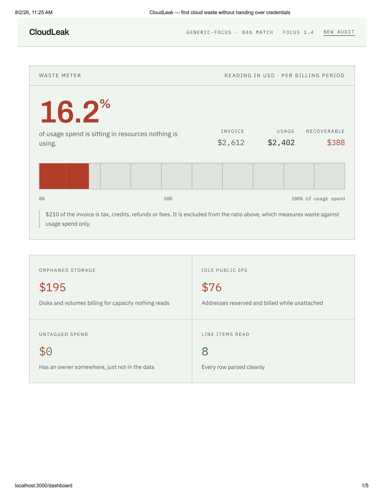
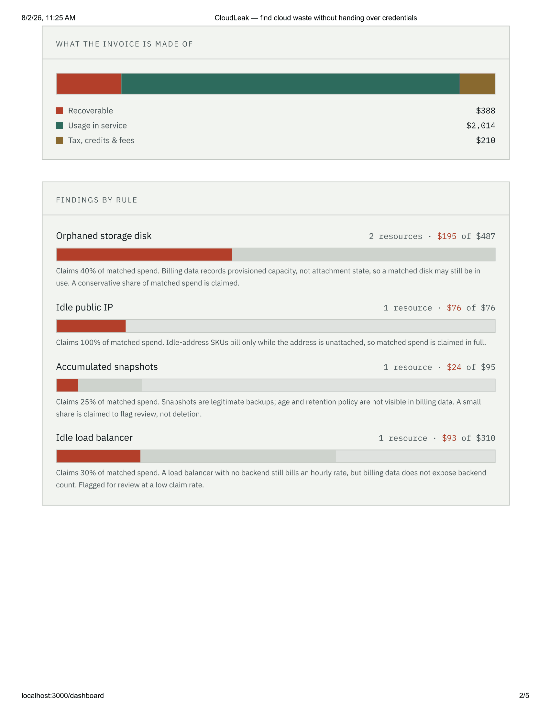

# CloudLeak

**Find cloud waste from a billing export. No IAM role, no API key, no live connection.**

Most cloud cost tools need read access to your production accounts. Getting that
approved takes a security review. CloudLeak takes a different route: it reads the
billing export you can already download today.

Upload the `.csv` from AWS Cost and Usage Reports, Azure Cost Management, or a GCP
billing export. CloudLeak works out which cloud it came from, normalizes it into a
single internal schema, finds spend going to resources nothing is using, and
generates the cleanup commands — for you to review and run yourself.





---

## What it finds

| Finding | How it's detected | What's claimed |
| --- | --- | --- |
| Orphaned storage | Disk, EBS volume and persistent-disk SKUs | 40% of matched spend |
| Idle public IPs | Unattached-address SKUs | 100% of matched spend |
| Accumulated snapshots | Snapshot and image-storage SKUs | 25% of matched spend |
| Idle load balancers | Load balancer and gateway SKUs | 30% of matched spend |
| Premium tier on cold storage | Premium/provisioned storage SKUs | 20%, flagged for review only |
| Untagged spend | No account, project or resource group | Reported, not counted as waste |
| Tax, credits, fees | Vendor charge-type column | Excluded from the ratio, reported separately |

Disk spend is claimed at 40% rather than in full because **a billing export records
what you were charged, not whether a disk is currently attached.** Idle-IP SKUs only
bill while the address is unattached, so that spend is claimed fully. Untagged spend
is a governance gap rather than waste — the money is buying something real, it just
has no owner — so it stays out of the headline figure.

Every one of these assumptions is printed on the report itself.

---

## Quick start

```bash
./run.sh          # macOS / Linux
.\run.ps1         # Windows — right-click, Run with PowerShell
```

Open `http://localhost:3000` and drop in any file from `samples/`.

The script installs dependencies, mints an API key, wires both halves together and
starts them. First run takes a few minutes.

Windows setup from scratch: [WINDOWS.md](WINDOWS.md).

---

## How it works

```
browser ──POST /api/audit──► Next.js route ──+ API key──► FastAPI
                                                            │ 202 + job id
browser ◄──────────────────── job id ◄──────────────────────┘
                                                     queue → worker thread
browser ──GET /api/audit/jobs/{id}──► Next.js ──► FastAPI ──► report
```

**1. Detect the cloud.** Only the header row is read, then scored against each
vendor's known columns — weighted, because cost columns are always present while
optional ones vary by export configuration. A CUR with resource IDs disabled still
resolves correctly.

**2. Normalize.** Vendor columns map to seven internal fields, each taking the first
candidate column that exists in the file. Rows whose cost value won't parse are
rejected and counted, never coerced to zero — a zeroed row would silently shrink the
denominator of the waste ratio.

**3. Separate usage from everything else.** A billing export is not only usage — it
also carries tax, credits, refunds, commitment fees and negations. Summing all of it
and calling the result "billed cost" makes the ratio wrong in both directions:
credits are negative and shrink the denominator, tax inflates it. FOCUS models this
as `ChargeCategory`; vendors expose their own version (AWS `lineItem/LineItemType`,
Azure `ChargeType`, GCP `cost_type`), which is normalized into `charge_category`.
Only usage and purchases enter the denominator, and non-usage totals are reported
separately. On `samples/aws_cur_with_charges.csv` this is the difference between a
reported 12.13% and the correct 13.38%.

**4. Detect waste.** Vectorized pandas rules match on the normalized categories, so
one rule covers all three clouds. Findings are aggregated **per resource** before
costing: a billing export carries one row per resource per day, so a single orphaned
disk can appear hundreds of times.

**5. Adapt to the export's FOCUS version.** Vendors adopt FOCUS at different paces,
so an enterprise routinely holds exports written against several versions at once —
plus historical files written against whatever was current at the time. CloudLeak
infers the version from the columns present (`InvoiceId` implies 1.4+, `ChargeClass`
implies 1.1+, `ServiceCategory` implies 1.0+), maps older column spellings
(`SubAccountId` → `SubAccountName`, `ServiceName` → `ServiceCategory`), and reports
analyses the detected version cannot support instead of silently returning zero.

**6. Generate commands.** Ranked by cost, deduplicated in stable order, and
shell-quoted (see Security).

Performance: a 400,000-row (29 MB) export processes in about 2.4 seconds while the
API stays responsive at single-digit milliseconds, because parsing runs on worker
threads rather than in the request handler.

---

## Security notes

- **Generated commands are shell-quoted.** Resource IDs come from an uploaded file
  and are pasted into a terminal, so every interpolated value passes through
  `shlex.quote`. `samples/injection_probe.csv` contains a disk named
  `disk-evil; rm -rf $HOME`; a test asserts it stays a single inert argument.
- **Nothing runs automatically.** Commands sit behind an explicit acknowledgement in
  the UI and are copy-only.
- **Uploads are never written to disk** and are dropped from memory as soon as
  parsing finishes. Reports expire on a TTL.
- **Jobs are scoped to the key that created them.** Another key requesting your job
  gets `404`, not `403`, so job IDs can't be probed.
- **API keys are stored as SHA-256 digests** and compared in constant time.
- **The browser never holds the API key.** It calls the app's own `/api/audit` routes,
  which attach the key server-side.
- **Production fails closed.** `CLOUDLEAK_ENV=production` without configured keys
  raises at startup rather than serving an open endpoint.

---

## Configuration

Every value has a working default. Full list in `backend/.env.example`.

| Variable | Default | Purpose |
| --- | --- | --- |
| `CLOUDLEAK_ENV` | `development` | `production` refuses to start without auth |
| `CLOUDLEAK_API_KEY_HASHES` | *(empty)* | SHA-256 digests of valid keys |
| `CLOUDLEAK_ALLOWED_ORIGINS` | `http://localhost:3000` | CORS allowlist |
| `CLOUDLEAK_RATE_LIMIT` / `_WINDOW` | `10` / `60s` | Audits per key per window |
| `CLOUDLEAK_MAX_JOBS_PER_KEY` | `3` | Concurrent audits per key |
| `CLOUDLEAK_WORKERS` | `2` | Simultaneous audits |
| `CLOUDLEAK_QUEUE_SIZE` | `64` | Backlog before `503` |
| `CLOUDLEAK_JOB_TIMEOUT` | `120s` | Kill switch for a pathological file |
| `CLOUDLEAK_JOB_TTL` | `900s` | How long a finished report is kept |
| `CLOUDLEAK_MAX_UPLOAD_MB` | `150` | Upload ceiling |
| `CLOUDLEAK_REDIS_URL` | *(empty)* | Share rate limits across instances |

Generate a key: `cd backend && python keygen.py "my-key"`

---

## Tests

```bash
cd backend && pip install pytest && python -m pytest tests/ -q
```

47 tests: detection and parsing accuracy against the sample exports, per-resource
aggregation, rejected-row accounting, shell-injection containment, authentication,
cross-tenant job access, rate limiting, queue backpressure, charge-type classification,
FOCUS version detection, per-rule attribution, and startup safety.

---

## Known limitations

Stated plainly, because the numbers matter more than the demo.

- **FOCUS version support is partial.** CloudLeak detects which FOCUS version an
  export was written against (0.5 through 1.4) and reports which analyses that
  version's columns cannot support, rather than returning zero for them. It does not
  yet implement the full column set of any version.
- **Not FOCUS-conformant.** The internal schema is *modelled on* the FinOps FOCUS
  specification and borrows its field naming, but FOCUS defines a large mandatory
  column set and controlled enumerations (`ServiceCategory`, `ChargeCategory` and
  others). CloudLeak uses seven fields and passes the vendor's own category strings
  through unchanged. Treat the naming as a nod to FOCUS, not a compliance claim.
- **The 40% disk reclaim factor is an assumption, not a measurement.** It needs
  calibration against real billing data.
- **No amortization or commitment-discount handling.** `BilledCost` only.
- **Attachment state cannot be proven from billing data.** Detection is based on SKU
  patterns, so findings should be verified in the console before acting.
- **Single instance.** The job queue and rate limiter are in-process; a job submitted
  to one instance is invisible to another. Set `CLOUDLEAK_REDIS_URL` for shared rate
  limiting. The app warns about this at startup.

---

## Built with

Python · FastAPI · pandas · Pydantic · pytest · Next.js · React · TypeScript · Tailwind CSS

Portions of this codebase were developed with AI assistance. Architecture, review and
correctness decisions are my own.

---

## License

MIT — see [LICENSE](LICENSE).
